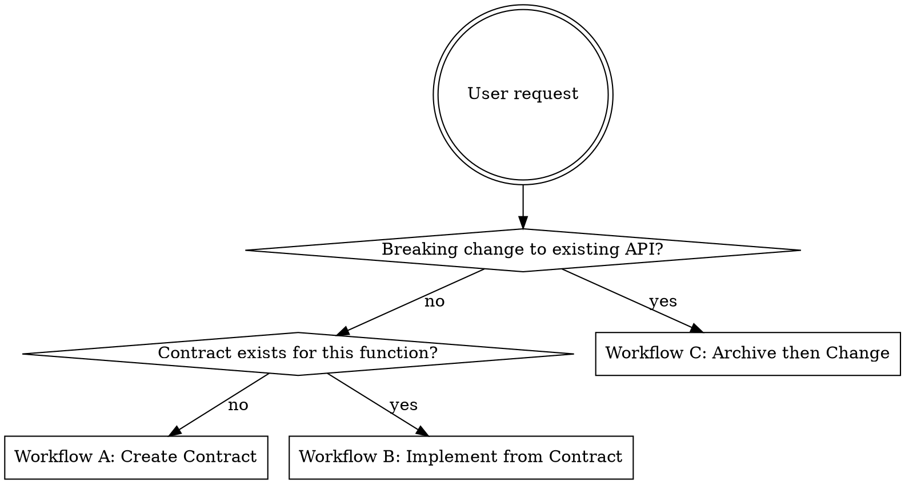

# Scientific ATDD Workflow

This project uses **Acceptance Test Driven Development** for scientific modeling.
Contract notebooks define the public API, expected inputs/outputs, and biological
plausibility constraints *before* any implementation. The notebook is simultaneously
the test, the documentation, and the scientific record.

## Core Principle

> The contract notebook specifies what "done" looks like. The agent's job is to
> make the notebook execute without errors and produce scientifically coherent output.
> Never modify the contract to fit the implementation — only modify the implementation
> to fit the contract.

---

## Entry Point — Determine Workflow

Based on the user's request, follow exactly ONE of these workflows:



| User intent | Workflow |
|---|---|
| "create contract for X" / "new function X" / no contract exists yet | **A — Create Contract** |
| "implement X" / "build out X" / contract `.py` already in `notebooks/contracts/` | **B — Implement from Contract** |
| "archive X" / "breaking change to X" / API signature is changing | **C — Archive then Change** |

If the user says "implement X" but no contract exists, run **A then B** sequentially.

---

## Workflow A: Creating a New Contract Notebook

1. **Gather requirements** — ask the user for (if not already provided):
   - The function name and module location (e.g. `src/pkg/module.py`)
   - A realistic sample input (or schema description)
   - The expected output structure
   - Key biological/scientific constraints that must hold
2. **Create `notebooks/contracts/{function_name}.py`** as a Jupytext percent-format file
   following the 5-section structure below
3. **Leave section 3 (the function call) calling a function that does not yet exist** —
   this is intentional; the notebook should fail until implemented
4. **Present the contract to the user for approval.** Do NOT proceed to implementation. Prompt the user to run the contract, then end the current session.

---

## Workflow B: Implementing from an Existing Contract

1. **Read the contract notebook** — identify the function signature, import path,
   input schema, output schema, and all assertions
2. **Create the implementation file** in `src/{package_name}/` with the module path
   inferred from the import statement in the contract
3. **Run the contract as a test** (pytest executes `.py` notebooks directly):
   ```bash
   make test-contracts
   ```
   Or for a single contract:
   ```bash
   pytest notebooks/contracts/{name}.py -v
   ```
4. **Iterate on the implementation only** until all assertions pass.
   Do NOT modify the contract without explicit user approval.
5. **Done** — do not add unit tests, refactor structure, or expand scope unless
   explicitly asked. Report results to the user (see Completion Summary below).

---

## Workflow C: Archiving Before a Breaking Change

Archiving **must** happen *before* any breaking change — if you break first, the
frozen outputs are wrong.

1. **Confirm with the user** that archiving is appropriate. State which contract
   will be archived and what the breaking change is.
2. **Convert and execute the current contract to a temporary file:**
   ```bash
   jupytext --to ipynb notebooks/contracts/{name}.py --output /tmp/{name}.ipynb
   jupyter nbconvert --to notebook --execute \
     /tmp/{name}.ipynb \
     --output /tmp/{name}_executed.ipynb
   ```
3. **Move the executed `.ipynb` (with frozen outputs) to the archive:**
   ```bash
   mkdir -p notebooks/archive/v{N}
   cp /tmp/{name}_executed.ipynb notebooks/archive/v{N}/{name}_v{N}.ipynb
   ```
4. **Add Quarto front matter to the archived notebook.** Insert a raw cell at the
   very top of the `.ipynb` with YAML front matter, then a markdown cell with the
   deprecation callout:

   **Raw cell (cell_type: raw):**
   ```yaml
   ---
   title: "Function Name — Contract (Archived v1)"
   execute:
     enabled: false
   ---
   ```

   **Markdown cell (cell_type: markdown):**
   ```markdown
   ::: {.callout-warning}
   **Archived notebook.** This reflects API version 1.x and is preserved as a
   scientific record. The current API is documented in
   [contracts/function_name.html](../../contracts/function_name.html).
   :::
   ```

5. **Remove or replace the `.py` contract** in `contracts/` with the new API version
6. **Commit the archive and the new contract in the same commit:**
   ```
   feat: break {function_name} API — archive v{N-1}, introduce v{N} with {change description}
   ```

---

## Contract Notebook Structure

Every contract notebook must contain these 5 sections as markdown + code cells:

```python
# %% [markdown]
# ## 1. Scientific Context
# Narrative: what biological/physical process is being modelled,
# what assumptions are made, references if applicable.

# %% [markdown]
# ## 2. Input Specification
# Document the schema of each input: column names, units, dtypes, valid ranges.

# %%
# Show a realistic sample input — not toy data.
# Use enough rows to exercise edge cases (at least ~30 time steps for
# time-series models; adjust to domain).

# %% [markdown]
# ## 3. Function Call
# Call the function exactly as it will be used publicly.

# %%
result = function_name(input_1, input_2, params)

# %% [markdown]
# ## 4. Output Assertions
# Encode the contract using all four assertion categories.

# %%
# --- type check ---
assert isinstance(result, pd.DataFrame)

# --- shape and column contract ---
EXPECTED_COLS = {"date", "value", "category"}
assert EXPECTED_COLS.issubset(result.columns), f"Missing: {EXPECTED_COLS - set(result.columns)}"
assert len(result) > 0, "Result must not be empty"

# --- dtype check ---
assert result["date"].dtype == "datetime64[ns]"
assert pd.api.types.is_float_dtype(result["value"])

# --- biological plausibility ---
# (domain-specific: bounds, monotonicity, mass balance, etc.)
assert (result["value"] >= 0).all(), "Negative values are biologically impossible"

# %% [markdown]
# ## 5. Interpretation
# At least one plot or summary table showing what correct output looks like.

# %%
# visualisation code
```

---

## Assertion Requirements

Every contract notebook **must** include all four assertion categories:

| Category | Required | Examples |
|---|---|---|
| Type check | Always | `assert isinstance(result, pd.DataFrame)` |
| Shape / column contract | Always | `assert set(COLS).issubset(result.columns)` |
| Dtype check | Always | `assert result['date'].dtype == 'datetime64[ns]'` |
| Biological plausibility | Always | Domain-specific bounds, monotonicity, mass balance, non-negativity |

Biological plausibility assertions are **non-negotiable** — a contract without them
is incomplete. If you are unsure what constraints apply, ask the user before proceeding.

### Common Biological Plausibility Patterns

```python
# Non-negativity (populations, concentrations, areas)
assert (result["population"] >= 0).all()

# Upper bound (proportions, percentages, probabilities)
assert (result["prevalence"] <= 1.0).all()

# Monotonicity (cumulative counts, time)
assert result["cumulative_cases"].is_monotonic_increasing

# Mass balance / conservation
assert abs(result["total"].sum() - expected_total) < TOLERANCE

# Temporal ordering
assert result["date"].is_monotonic_increasing

# No NaN in critical columns
assert result[CRITICAL_COLS].notna().all().all()
```

---

## File Conventions

```
_quarto.yml                ← Quarto site config (project root)

notebooks/
├── contracts/             ← live contracts: tested in CI, rendered by Quarto
│   ├── conftest.py        ← pytest collector: runs .py notebooks via jupytext + nbclient
│   ├── {name}.py          ← Jupytext percent-format source (SOURCE OF TRUTH)
│   └── slow/              ← pre-executed slow contracts (committed as .ipynb)
│       └── {name}.ipynb   ← .ipynb with frozen outputs, too slow for CI
└── archive/
    └── v{N}/              ← frozen historical record, never executed
        └── {name}_v{N}.ipynb   ← .ipynb only, outputs saved, committed

src/
└── {package_name}/
    └── {module}.py        ← implementation files
```

**Source of truth is always the `.py` file.** Never edit `.ipynb` directly.
No `.ipynb` conversion is needed for testing — `notebooks/contracts/conftest.py` teaches
pytest to collect and execute `.py` percent-format notebooks directly using jupytext +
nbclient in-memory. Only `archive/` and `contracts/slow/` contain committed `.ipynb` files.
The `.ipynb` in `archive/` is committed with outputs frozen.

---

## Jupytext Front Matter

Standard front matter for all contract notebooks (top of `.py` file):

```python
# ---
# title: "{Function Name} — Contract"
# execute:
#   enabled: true
# jupyter:
#   jupytext:
#     text_representation:
#       extension: .py
#       format_name: percent
#   kernelspec:
#     display_name: Python 3
#     language: python
#     name: python3
# ---
```

For slow contracts (e.g. Monte Carlo validation), place them in
`notebooks/contracts/slow/` as pre-executed `.ipynb` files with frozen outputs.
These are committed to the repo (allowed by `.gitignore`) and excluded from
`make test-contracts`. Test them separately when needed:

```bash
pytest notebooks/contracts/slow/ -v
```

---

## Running Tests

The project uses a custom pytest collector (`notebooks/contracts/conftest.py`)
that executes `.py` percent-format notebooks directly using jupytext + nbclient
in-memory. No `.ipynb` conversion is needed.

```bash
# All live contracts (recommended)
make test-contracts

# Single contract
pytest notebooks/contracts/{name}.py -v
```

Slow contracts in `notebooks/contracts/slow/` are pre-executed `.ipynb` files
and are excluded from `make test-contracts`. Test them separately:

```bash
pytest notebooks/contracts/slow/ -v
```

---

## Completion Summary

After finishing any workflow, report to the user:

```
Workflow:     [A: Create Contract | B: Implement | C: Archive]
Contract:     notebooks/contracts/{name}.py
Module:       src/{package}/{module}.py  (if applicable)
Test result:  pytest notebooks/contracts/{name}.py → PASSED / FAILED
Assertions:   N type, N shape, N dtype, N plausibility
Next steps:   [user review / commit / further iteration]
```

---

## What NOT to Do

- Do not modify a contract notebook to make implementation easier
- Do not add `try/except` blocks to suppress assertion failures
- Do not write implementation code inside the contract notebook
- Do not edit `.ipynb` files directly — always edit the `.py` source
- Do not archive after breaking — archive before, or the frozen outputs are wrong
- Do not execute archived notebooks — they must stay frozen
- Do not proceed past the contract step without user approval
